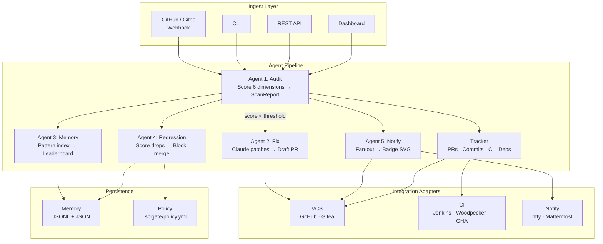
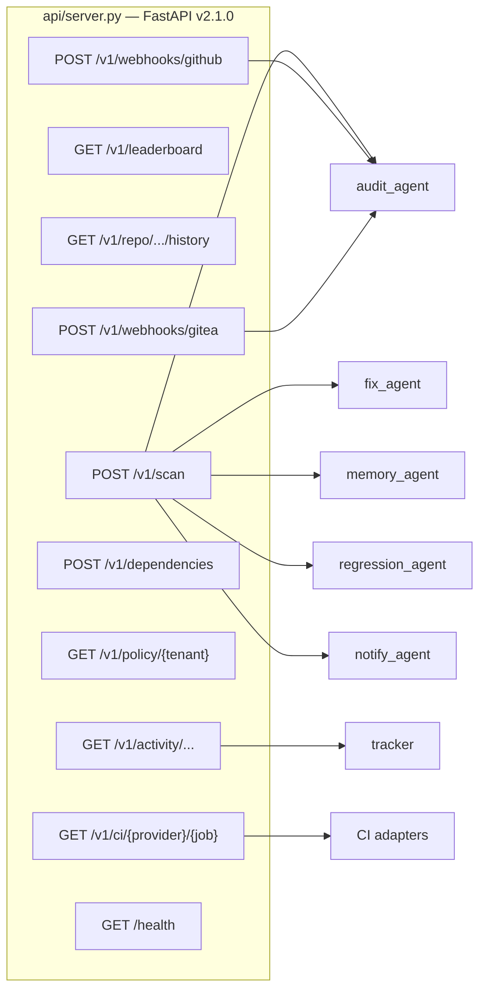
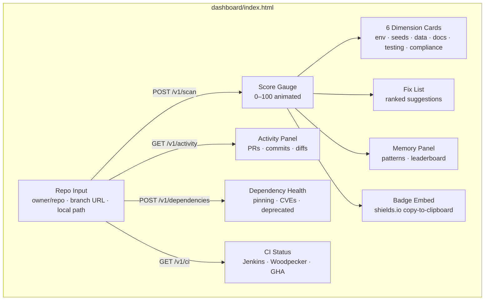
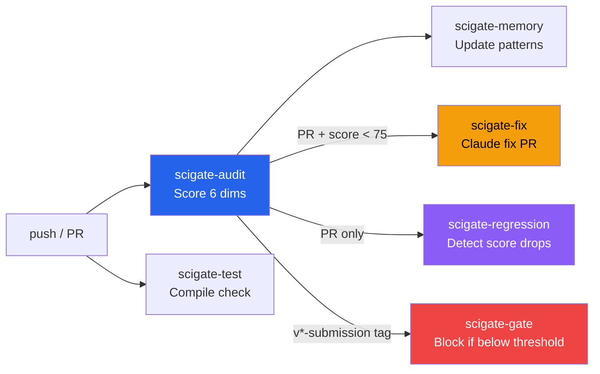
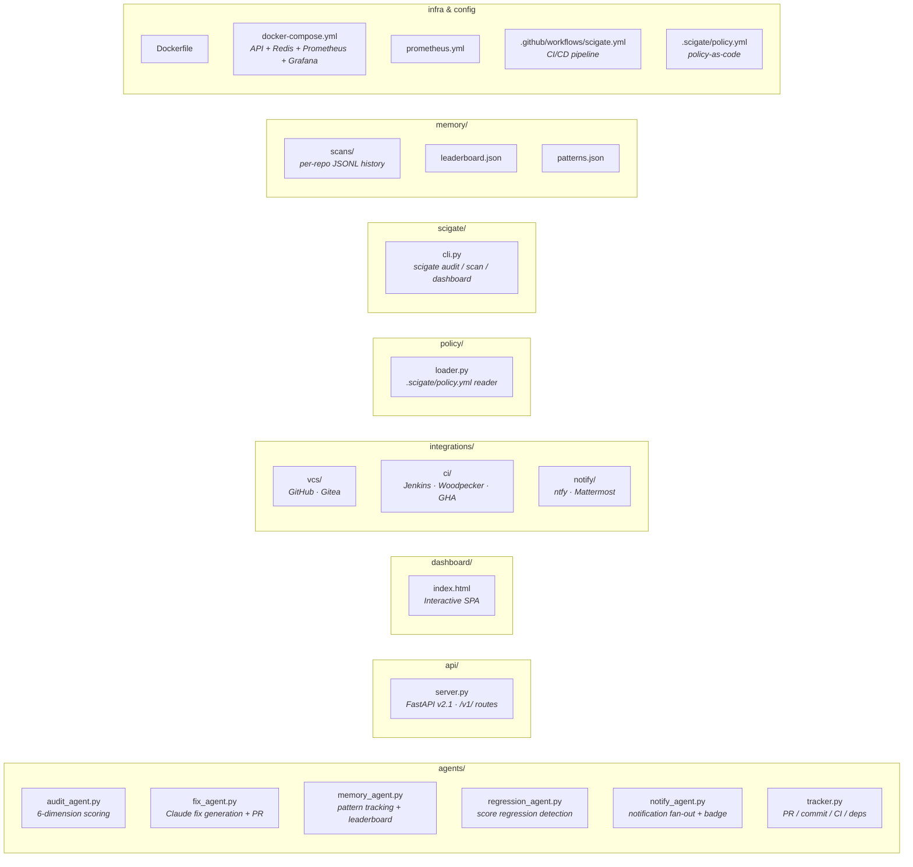

# SciGate

**Scientific Reproducibility Intelligence Platform**

SciGate is a 5-agent pipeline that audits every push and pull request against
a 6-dimension reproducibility rubric (0–100), auto-generates Claude-powered
fix PRs for failing repos, tracks score regressions across branches, and
maintains an org-wide memory of failure patterns — all triggered automatically
from GitHub Actions, webhooks, CLI, or the interactive dashboard.

Self-hostable. 100% open-source infrastructure. No vendor lock-in.

---

## Architecture

### System Overview



### Backend (FastAPI)



### Frontend (Dashboard SPA)



Every PR and push to `main` triggers the full pipeline automatically via
GitHub Actions or webhook. PRs receive a commit status check with the score
and grade, and a draft fix PR is opened when the score falls below the gate
threshold.

---

## Scoring (6 Dimensions = 100 pts)

| Dimension | Max | What it checks |
|---|---|---|
| Environment | 17 | `requirements.txt` / `environment.yml`, pinned deps, Dockerfile tag |
| Seeds & Determinism | 17 | Unseeded `random`, `np.random`, `torch.manual_seed`, etc. |
| Data Provenance | 17 | Hardcoded paths, download scripts, raw data committed |
| Documentation | 17 | Run instructions, hardware, runtime, expected outputs, citation |
| Testing & Validation | 17 | Test suite presence, coverage ratio, assertions, smoke tests |
| License & Compliance | 15 | LICENSE file, copyleft conflicts, NOTICE file |

### Grades

| Grade | Range | Gate Behavior |
|---|---|---|
| EXCELLENT | 90–100 | Auto-approve |
| GOOD | 75–89 | Approve with suggestions |
| FAIR | 50–74 | Block merge; draft fix PR opened |
| POOR | 25–49 | Block merge; notify team lead |
| CRITICAL | 0–24 | Block merge; escalation |

---

## Quick Start

### Docker (recommended)

```bash
git clone https://github.com/parthassamal/SciGate && cd SciGate
cp .env.example .env
# Edit .env: set ANTHROPIC_API_KEY, GITHUB_TOKEN

docker compose up --build
# Dashboard at http://localhost:8000

# With observability stack (Prometheus + Grafana):
docker compose --profile observability up --build
```

### Local Python

```bash
pip install -r requirements.txt
uvicorn api.server:app --reload --port 8000
# Dashboard at http://localhost:8000
```

### CLI

```bash
pip install -e .

scigate audit /path/to/repo           # rich terminal output
scigate audit /path/to/repo --json-out # JSON output
scigate scan /path/to/repo            # JSON for piping
scigate dashboard                     # launch web UI on :8000
```

### Standalone agents

```bash
# Audit a local repo
python agents/audit_agent.py --path /path/to/repo --pretty

# Audit a GitHub repo at a specific branch
python agents/audit_agent.py --github-repo owner/repo --ref feature-branch --out report.json

# Run fix agent (requires ANTHROPIC_API_KEY)
python agents/fix_agent.py --score-json report.json --repo owner/repo

# Update org memory
python agents/memory_agent.py --score-json report.json --repo-name owner/repo

# Check for score regression
python agents/regression_agent.py --score-json report.json --repo-name owner/repo
```

---

## Scanning PRs & Branches

SciGate audits any PR or branch through three paths:

| Path | Trigger | What happens |
|---|---|---|
| **GitHub Actions** | Push to `main` or PR opened/updated | Audit → Fix (if score < 75) → Memory → Regression (on PRs) → Gate |
| **Webhook** | `POST /v1/webhooks/github` | Scans PR head branch, posts commit status check, opens fix PR if below threshold |
| **Dashboard / API** | Paste `owner/repo/tree/my-branch` or call `POST /v1/scan` with `ref` | Scans the specified branch and returns full report |

Webhooks handle both `push` and `pull_request` events. For PRs, only
`opened`, `synchronize`, and `reopened` actions trigger a scan — label
changes, reviews, and other events are ignored.

---

## Integration Layer

SciGate uses an adapter pattern for all external services. Adding a new
provider means implementing one class.

### VCS Adapters (`integrations/vcs/`)
- **GitHub** — REST API v3 (default)
- **Gitea** — REST API v1 (self-hosted)
- Set `VCS_PROVIDER=github|gitea`

### CI Adapters (`integrations/ci/`)
- **Jenkins** — REST API
- **Woodpecker CI** — REST API (recommended OSS CI)
- **GitHub Actions** — REST API
- Set `CI_PROVIDER=jenkins|woodpecker|gha`

### Notification Adapters (`integrations/notify/`)
- **ntfy** — self-hostable push notifications
- **Mattermost** — open-source Slack alternative
- Set `SCIGATE_NOTIFY_CHANNELS=ntfy,mattermost`

---

## API Endpoints

All endpoints are available under the `/v1/` prefix. Legacy routes without
the prefix are maintained for backward compatibility.

### Scan & Score
| Method | Path | Description |
|---|---|---|
| POST | `/v1/scan` | Audit a repo (local path, GitHub URL, or Gitea) |
| GET | `/v1/leaderboard` | Org memory leaderboard + pattern index |
| GET | `/v1/repo/{slug}/history` | Scan history for a specific repo |
| GET | `/health` | Service health + agent status |

### Activity & Code Tracking
| Method | Path | Description |
|---|---|---|
| GET | `/v1/activity/{owner}/{repo}` | Combined PR + commit summary |
| GET | `/v1/activity/{owner}/{repo}/commits` | Recent commits |
| GET | `/v1/activity/{owner}/{repo}/prs` | Open + recent PRs |
| GET | `/v1/activity/{owner}/{repo}/diff/{sha}` | Diff for a single commit |
| GET | `/v1/activity/{owner}/{repo}/compare/{base}/{head}` | Diff between two refs |

### CI Status
| Method | Path | Description |
|---|---|---|
| GET | `/v1/ci/{provider}/{job}` | Job status (`jenkins`, `woodpecker`, `gha`) |
| GET | `/v1/ci/{provider}/{job}/builds` | Build history |

### Dependencies
| Method | Path | Description |
|---|---|---|
| POST | `/v1/dependencies` | Dependency health analysis (pinning, CVEs, deprecated) |

### Policy & Webhooks
| Method | Path | Description |
|---|---|---|
| GET | `/v1/policy/{tenant}` | Load tenant policy from `.scigate/policy.yml` |
| POST | `/v1/webhooks/github` | GitHub webhook receiver (HMAC-SHA256 verified) |
| POST | `/v1/webhooks/gitea` | Gitea webhook receiver |

---

## Policy-as-Code

Place `.scigate/policy.yml` in your repo root to configure gate behavior:

```yaml
gate_threshold: 75
regression_gate: true
regression_threshold: -5
notify_channels: [ntfy, mattermost]
protected_branches: [main, release/*]
```

---

## Environment Variables

| Variable | Required | Default | Description |
|---|---|---|---|
| `ANTHROPIC_API_KEY` | For fixes | — | Anthropic API key (Agent 2) |
| `GITHUB_TOKEN` | For remote scans | — | GitHub PAT or App token |
| `VCS_PROVIDER` | No | `github` | `github` or `gitea` |
| `CI_PROVIDER` | No | `jenkins` | `jenkins`, `woodpecker`, or `gha` |
| `SCIGATE_THRESHOLD` | No | `75` | Gate threshold score |
| `SCIGATE_NOTIFY_CHANNELS` | No | — | Comma-separated: `ntfy,mattermost` |
| `JENKINS_URL` | For Jenkins CI | — | Jenkins base URL |
| `JENKINS_USER` / `JENKINS_TOKEN` | For Jenkins CI | — | Jenkins auth |
| `WOODPECKER_URL` / `WOODPECKER_TOKEN` | For Woodpecker | — | Woodpecker CI auth |
| `GITEA_URL` / `GITEA_TOKEN` | For Gitea | — | Gitea instance auth |
| `GITHUB_WEBHOOK_SECRET` | For webhooks | — | HMAC secret for webhook verification |
| `NTFY_URL` / `NTFY_TOPIC` | For ntfy | — | ntfy push notifications |
| `MATTERMOST_WEBHOOK_URL` | For Mattermost | — | Mattermost incoming webhook |

See `.env.example` for the full list.

---

## GitHub Actions CI/CD

The `.github/workflows/scigate.yml` workflow runs on every push to `main`
and on every pull request:



| Job | Trigger | Purpose |
|---|---|---|
| **scigate-audit** | All pushes + PRs | Run audit agent, output score, upload report artifact |
| **scigate-test** | All pushes + PRs | Compile-check all Python files |
| **scigate-fix** | PRs + tags when score < 75 | Run Claude fix agent, open fix PR |
| **scigate-memory** | All pushes + PRs | Update org memory patterns and leaderboard |
| **scigate-regression** | PRs only | Compare against previous scores, flag regressions |
| **scigate-gate** | `v*-submission` tags only | Block tag if score < threshold |

---

## Project Structure



| Directory | Purpose |
|---|---|
| `agents/` | 5 pipeline agents + tracker module |
| `api/` | FastAPI server with versioned routes (`/v1/`) |
| `dashboard/` | Single-page web UI with score gauge, dimension cards, activity panels |
| `integrations/` | Adapter pattern: VCS (GitHub, Gitea), CI (Jenkins, Woodpecker, GHA), Notify (ntfy, Mattermost) |
| `policy/` | Policy-as-code loader for `.scigate/policy.yml` |
| `scigate/` | CLI package (`scigate audit`, `scigate scan`, `scigate dashboard`) |
| `memory/` | Flat-file persistence: per-repo scan history, leaderboard, patterns |
| `infra/` | Prometheus config, Docker Compose with observability profile |
| `tests/` | Scoring engine tests |

---

## License

MIT
